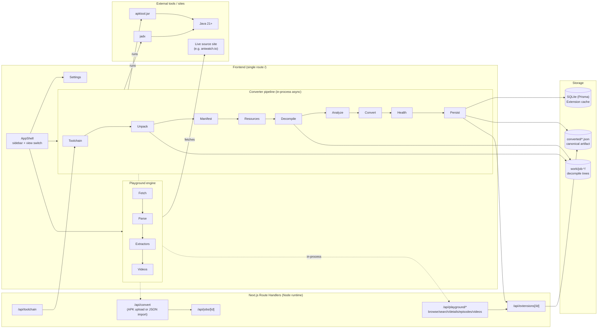

# Architecture

This document describes how EXT-TO-JSON fits together end-to-end: the runtime
shape of the Next.js app, the API surface, the converter pipeline modules, the
playground engine, and the persistence model.

> For field-level documentation of the produced JSON, see
> [`JSON_SCHEMA.md`](./JSON_SCHEMA.md). For a step-by-step trace of what
> happens when you upload an APK, see [`CONVERSION_PIPELINE.md`](./CONVERSION_PIPELINE.md).

---

## 1. High-level shape

EXT-TO-JSON is a **single-route Next.js App Router application**. There is one
page (`src/app/page.tsx`) that renders `<AppShell/>`. The AppShell keeps the
active view in local React state and swaps between three views:

- `Converter` — upload APK / import JSON, watch the job, see the result.
- `Playground` — pick a converted extension, browse → details → episodes →
  videos → player.
- `Settings` — toolchain status + theme toggle.

There is no router-based navigation between these views; switching is a
client-side state change. This keeps the UX snappy (no full page reloads) and
makes the app trivially deployable as a single static entrypoint backed by
Node API routes.

The backend is a small set of **Next.js Route Handlers** under
`src/app/api/`. They are all `runtime = "nodejs"` and `dynamic =
"force-dynamic"` because the converter spawns child processes (apktool, jadx)
and the playground makes outbound HTTP requests to live sites.

### Mermaid diagram

---

## 2. The frontend

`src/components/app-shell.tsx` is the spine. It:

- Holds a `view: "converter" | "playground" | "settings"` state.
- Renders a floating rounded sidebar on desktop (`lg:` breakpoint) and a
  `Sheet`-based drawer on mobile.
- Animates view transitions with `framer-motion`'s `<AnimatePresence>` — each
  view fades/slides in/out on a 200 ms curve.
- Provides an `openInPlayground(id)` callback so the Converter view can hand
  off to the Playground after a successful conversion.
- Wraps everything in a React Query `QueryClientProvider` with sensible
  defaults (`retry: 1`, no refetch on focus).

All client ↔ server calls go through `src/lib/api.ts`, a thin typed wrapper
around `fetch` that:

- Always surfaces backend errors (never silently swallows them).
- Returns typed results matching the playground/converter contracts.
- Is the single place to change if the API contract evolves.

---

## 3. API surface

| Method & path | Body / query | Returns | Notes |
| --- | --- | --- | --- |
| `POST /api/convert` | multipart `apk` | `{ jobId, status: "queued" }` | Spawns the pipeline in the background; client polls `/api/jobs/:id`. |
| `POST /api/convert?importJson=1` | multipart `json` | `{ extensionId, imported }` | Bypass the pipeline; import a previously produced JSON file directly. |
| `GET /api/jobs` | — | `{ jobs: ConversionJob[] }` | List recent jobs (in-memory store). |
| `GET /api/jobs/[id]` | — | `{ job: ConversionJob }` | Poll a single job (progress, status, logs). |
| `GET /api/extensions` | — | `{ extensions: ExtensionSummary[] }` | Library listing from the SQLite cache. |
| `GET /api/extensions/[id]` | — | `ExtensionJson` | Full JSON document. |
| `DELETE /api/extensions/[id]` | — | `{ ok: true }` | Removes the DB row **and** the `converted/<id>.json` file. |
| `GET /api/toolchain` | — | `{ ready, tools, error, paths }` | Reports whether apktool + jadx + java are present and runnable, with version strings. |
| `POST /api/playground/browse` | `{ extensionId, type, page }` | `BrowseResult` | Fetches the popular or latest page live and applies the JSON's CSS selectors. |
| `POST /api/playground/search` | `{ extensionId, query, page, filters }` | `BrowseResult` | Same as browse but for the search endpoint. |
| `POST /api/playground/details` | `{ extensionId, url }` | `DetailsResult` | Fetches an anime URL and applies the details selectors. |
| `POST /api/playground/episodes` | `{ extensionId, url }` | `EpisodesResult` | Fetches the episode list page and applies the episode selectors. |
| `POST /api/playground/videos` | `{ extensionId, url, serverName? }` | `VideosResult` | Fetches the video page, locates server embeds, runs each server's extractor, aggregates videos/subtitles/audio. |

Every playground response carries a `fetch: { ok, status, url, error? }`
sub-object and a `warnings: string[]` array. If the live fetch failed, or the
CSS selector matched nothing, or an extractor was unsupported, the UI shows
that **explicitly** — there is no silent "no results" state.

---

## 4. The converter pipeline

`src/lib/converter/convert.ts` is the orchestrator. It runs the following
stages sequentially (each is async and non-blocking — the Next.js Route
Handler returns the `jobId` immediately and `void runConversion(...)` continues
in the background):

| Stage | Module | What happens | Typical time |
| --- | --- | --- | --- |
| `unpacking` | `toolchain.ts` → `unpack.ts` | Resolve + verify apktool/jadx/java; sha256 the APK; `apktool d -f --no-src -o out apk` produces `AndroidManifest.xml` + `res/`. | 2–4 s |
| `decoding-manifest` | `manifest.ts` → `resources.ts` | Regex-parse the decoded manifest for package name, version code/name, `<meta-data>`, label/icon refs. Read `res/values/strings.xml` for resource strings. | < 100 ms |
| `decompiling` | `decompile.ts` | `jadx -d out --no-res --show-bad-code --threads-count 4 apk` produces a tree of `.java` files. | 4–10 s |
| `analyzing` | `analyze.ts` | Walk the tree, find classes extending a known Aniyomi base, score candidates, pick the best (or the manifest-hinted one), extract properties / method overrides / selectors / request URLs / FromElement selectors / filters / detected extractors. | < 1 s |
| `assembling` | `convert.ts` | Map the analysis to the `ExtensionJson` schema. Build browse endpoints, details, episodes, videos (servers from `detectedExtractors`), subtitles, audio. | < 100 ms |
| `health-check` | `health.ts` | Run 13 checks (manifest, source-class, base-url, language, name, method-overrides, browse-popular, browse-search, details, episodes, videos, servers, filters). Compute a 0–100 score and a `healthy | warning | error` status. | < 100 ms |
| `done` | `persist.ts` | Write `converted/<id>.json` to disk and upsert the `Extension` row in SQLite. | < 100 ms |

Total wall time on a typical extension: **8–15 seconds**.

The job's progress is reported through an `onProgress(stage, progress, message)`
callback that the API handler forwards to the in-memory job store
(`src/lib/converter/jobs.ts`). The store is hung off `globalThis` so it
survives Next.js dev hot-reloads. The frontend polls `/api/jobs/:id` every
~1 s until `status === "done" || "error"`.

---

## 5. The playground engine

The playground is **not a mock**. It genuinely fetches the live source site
server-side (so there are **no CORS issues**) and applies the JSON's CSS
selectors via cheerio — exactly the same selectors the original Aniyomi
extension would apply via JSoup.

Pipeline (in `src/lib/playground/`):

1. **`fetch.ts`** — `fetchPage(url, source, headers, timeout)`. Builds a
   realistic browser User-Agent + the extension's configured headers, follows
   redirects, aborts on 30 s timeout. Returns a structured `FetchResult` with
   `ok`, `status`, `url`, `html`, `contentType`, `error?`. **Never throws** —
   failures become `FetchResult.error` strings that bubble to the UI.

2. **`parse.ts`** — Loads the HTML with cheerio and applies the JSON's
   selectors. Three functions:
   - `fetchAndParseBrowse(ext, endpoint, page, query?, filters?)` — applies
     `parse.itemSelector`, then per-item `title` / `url` / `thumbnail` /
     `extras`. Detects next-page via `a[rel="next"]`.
   - `fetchAndParseDetails(ext, animeUrl)` — applies the `details.*`
     selectors, maps raw status text through `statusMapping`.
   - `fetchAndParseEpisodes(ext, animeUrl)` — applies `episodes.parse.*`
     selectors; supports `numberExtraction: regex | float | index` with an
     optional `numberRegex`.

3. **`extractors/index.ts`** — A registry of best-effort extractors:
   - `direct` — the URL is itself a `.mp4`/`.m3u8`/`.mkv` file.
   - `generic` — fetch the page, regex-scan for `https?://….m3u8`,
     `https?://….mp4`, `"file":"…"` patterns, and `<iframe src="…">` (one
     level of recursion).
   - **Named extractors** (`vidstream`, `gogo`, `mp4upload`, `doodstream`,
     `streamtape`, `filemoon`, `kwik`, `mixdrop`, `streamlare`, `streamwish`,
     `fembed`, `sendvid`, `streamsb`, `voe`, `yourupload`, `zoro`, `aniwatch`,
     `kaido`, `miruro`) — delegate to `generic` but **label the result** so
     the UI can show an honest "this server may need anti-bot solving we don't
     implement" note.
   - `unsupportedExtractor` — explicit "no extractor registered" note. Never
     returns zero videos silently.

4. **`videos.ts`** — `resolveVideos(ext, episodeUrl, onlyServerName?)`:
   - Fetches the video page (`ext.videos.url` template, or the episode URL).
   - For each configured server, runs the server's CSS selector to find its
     embed URL, then runs the server's extractor.
   - If no servers are configured, runs `generic` directly on the page.
   - Aggregates videos, dedupes by URL, collects `resolutions`, `formats`,
     `subtitleTracks`, `audioTracks`.
   - Returns per-server `ServerResult`s (with `notes`, `unsupported`, `error?`)
     so the UI can show exactly which server produced what.

---

## 6. Persistence model

Two stores, kept in sync by `persist.ts`:

- **`converted/<id>.json`** — the canonical artifact. Pretty-printed
  ExtensionJson. Synced to GitHub. Survives `prisma migrate reset`. This is
  the source of truth.
- **`SQLite via Prisma`** (`prisma/schema.prisma`) — a denormalized cache of
  the same data for fast listing/lookup. Columns: identity (name, lang,
  baseUrl, packageName unique, sourceType, sourceClassName, isNsfw), APK
  provenance (apkFileName, apkSha256, apkVersionCode, apkVersionName), health
  (healthScore, healthStatus, healthSummary), capabilities (JSON string), and
  the full `json` document as a string. Indexed on `lang` and `healthStatus`.

`persistExtension` upserts by `packageName` — re-converting the same APK
overwrites the previous JSON file (same id) and DB row.

`loadExtensionJson(id)` reads from disk (canonical), not from the DB. This
guarantees the playground always uses the file content even if the DB is stale
or reset.

The `work/job-<timestamp>/` directories hold the per-conversion decompile
trees (apktool-out + jadx-out). They are gitignored. They are **kept** after
conversion so you can debug a misclassified source; delete them anytime.

---

## 7. The toolchain

`src/lib/converter/toolchain.ts` resolves three paths relative to
`process.cwd()`:

- `tools/apktool.jar` — the Apktool release jar.
- `tools/bin/jadx` — the jadx launcher script (ships `jadx.bat` for Windows
  and a shell `jadx` for Unix in the same `bin/` directory).
- `java` — from `JAVA_HOME/bin/java` if set, otherwise PATH.

`verifyToolchain` runs `java -version`, `java -jar apktool.jar --version`, and
`jadx --version`, capturing the first line of each. The `/api/toolchain`
endpoint exposes this so the Settings screen can show a clear "ready / not
ready" indicator.

Installation is handled by either `START.bat` (Windows, uses PowerShell) or
`scripts/download-tools.ts` (macOS/Linux, uses `unzip`). Both are idempotent
and skip downloads if the target files already exist. See
[`TOOLCHAIN.md`](./TOOLCHAIN.md) for details.

---

## 8. Design constraints (why this shape)

- **Single route, client-side view switching** — avoids full page reloads
  during playground navigation, keeps the bundle smaller than a multi-route
  app would, and lets `framer-motion` do clean view transitions.
- **In-memory job store hung off `globalThis`** — survives Next.js dev
  hot-reloads (a fresh module instance would otherwise lose ongoing jobs). In
  production a real queue would be substituted here without changing the
  public API contract.
- **Disk JSON as the canonical artifact** — the DB can be rebuilt from the
  `converted/` folder; the reverse is not true. This makes the library
  reviewable in PRs.
- **Server-side playground fetch** — bypasses CORS, lets us send realistic
  headers, and centralizes error handling. The trade-off is that the dev
  server's IP is the one making requests; for geo-blocked sources, run the
  dev server on a machine in the right region.
- **Explicit "unsupported" extractors** — returning `unsupported: true` with
  a note is far more useful to a developer than silently returning zero
  videos. Every server outcome is surfaced in the UI.
